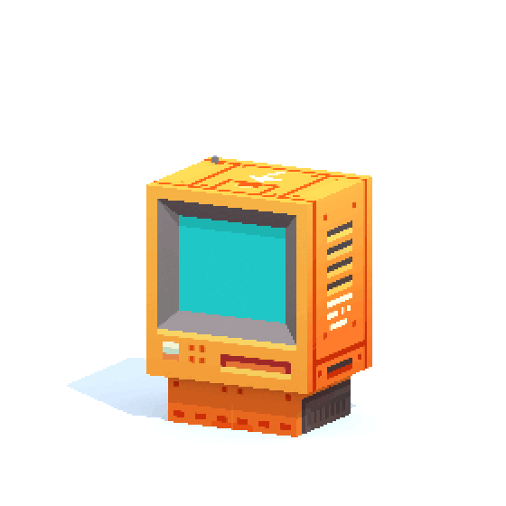
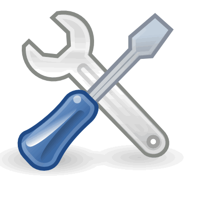

<h1 align="center">Hi <!--👋-->, I'm Manda Sreeprad</h1>

  

<!-- 
  
 -->

<h3 align="left">About me</h3>
<ul>
<li>I'm a 2nd year student, pursuing my B.Tech. in Electrical & Communication Engineering</li>
<li>🎓 Tech Grad 🛠️ PCB Design, Python</li>
<li>🧠 Concept to Design Expert</li>
<li>💼 Real Projects Enthusiast</li>
<li>🚀 GATE & ECE Aspirant 📶</li>
<li>📄 Know about my experiences[Resume](https://crimson-krystalle-38.tiiny.site)
</ul>
<h3 align="left">Let's connect</h3>

 -->

<h3 align="left"> Languages and Tools</h3>
<ul>
<li>Programming Languages:</li>

     

<li>Web Development:</li>

        

<li>AI/ML:</li>

       

<li>Database:</li>

  

<li>Framework:</li>

  

<li>Software:</li>

     

</ul>

<h3 align="left"> Github Stats</h3>
<table>
<tbody>
<tr>
    <td>
&nbsp;
</td>
    <td>

</td>
  </tr>
  <tr>
    <td colspan="2">

</td>
  </tr>
</tbody>
</table>
